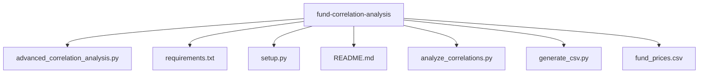

# Fund Correlation Analysis

This project analyzes correlations between different funds using historical price data. It includes static correlation analysis, rolling correlations, cluster analysis, and various visualizations.

## Features

- Static correlation analysis with statistical significance
- Rolling correlation analysis with configurable time windows
- Cluster analysis using both hierarchical and K-means clustering
- Correlation heatmaps and dendrograms
- Comprehensive statistical summaries
- Time series visualizations

## Project Structure 



## Prerequisites

- Python 3.8 or higher
- pip (Python package installer)

## Installation

1. Clone the repository:
```bash
git clone <repository-url>
cd fund-correlation-analysis
```

2. Create and activate a virtual environment:

**Windows:**
```bash
python -m venv venv
.\venv\Scripts\activate
```

**Linux/Mac:**
```bash
python3 -m venv venv
source venv/bin/activate
```


3. Install dependencies:
```bash
pip install -r requirements.txt
```

or
```bash
python setup.py
```


## Usage

1. Prepare your data:
   - Ensure your CSV file is named `fund_prices.csv`
   - The file should have a 'Date' column and multiple fund price columns
   - Fund columns should be named 'fondo1', 'fondo2', etc.

2. Run the analysis:
```bash
python advanced_correlation_analysis.py
```


3. Check the output:
   - The script will generate several visualization files:
     - correlation_heatmap.png
     - rolling_correlations.png
     - dendrogram.png
   - Console output will show:
     - Top correlated pairs
     - Cluster analysis results
     - Statistical summaries

## Customization

You can modify the following parameters in the script:

- `correlation_threshold` (default: 0.8)
- Rolling window size (default: 60 days)
- Number of clusters (default: 5)

To change these, modify the corresponding parameters in the main() function call.

## Output Files

The script generates several visualization files:

1. **correlation_heatmap.png**
   - Shows the correlation matrix as a heatmap
   - Red indicates positive correlations
   - Blue indicates negative correlations

2. **rolling_correlations.png**
   - Shows how correlations change over time
   - Displays top 5 most correlated pairs

3. **dendrogram.png**
   - Hierarchical clustering visualization
   - Shows fund relationships in tree structure

## Troubleshooting

Common issues and solutions:

1. **Missing dependencies:**
   ```bash
   pip install -r requirements.txt
   ```

2. **Memory issues with large datasets:**
   - Reduce the number of funds analyzed
   - Increase your system's available memory

3. **CSV format issues:**
   - Ensure your CSV has the correct format
   - Check date format is consistent
   - Verify column names are correct

## Contributing

Feel free to submit issues and enhancement requests!

## License

This project is licensed under the MIT License - see the LICENSE file for details.

## Contact

For any questions or support, please contact [Your Contact Information].